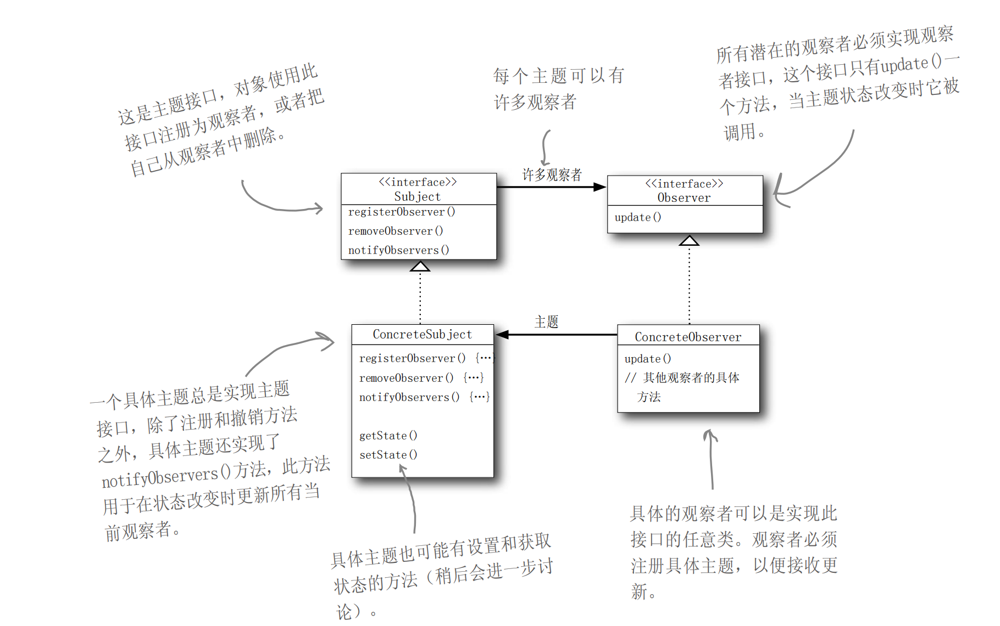
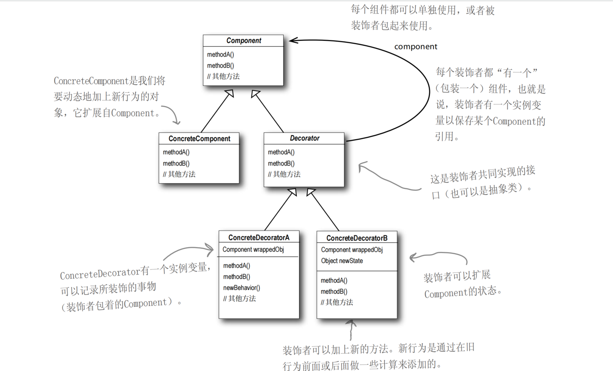
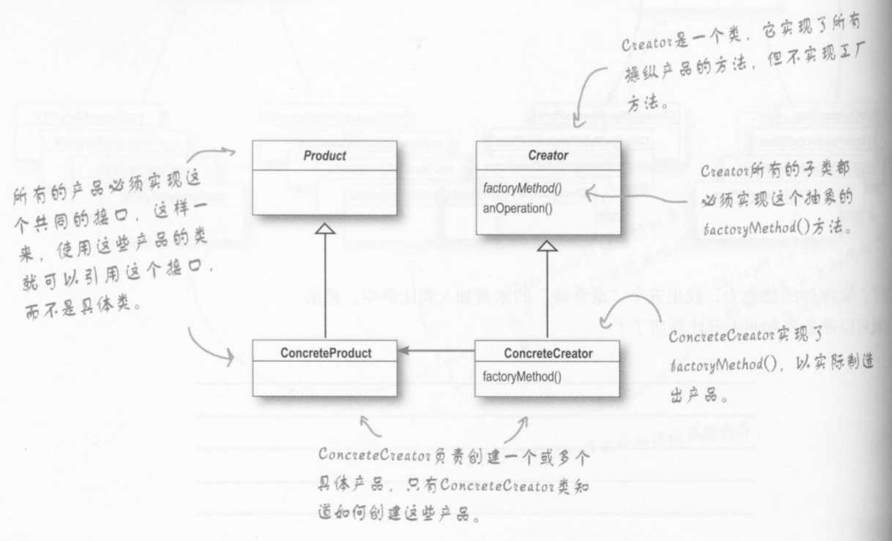
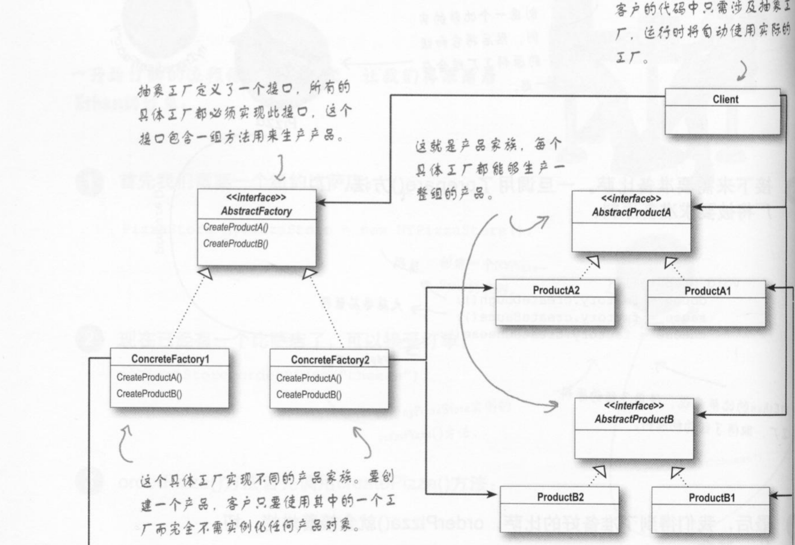

<!--
 * @Author: 
 * @Date: 2024-12-26 14:14:39
 * @LastEditTime: 2024-12-27 17:40:08
 * @Description: 设计模式
-->

# 设计模式

阅读Head First设计模式后读书笔记， 并使用C++ 重写书中的代码

## 设计原则

- 找出应用中可能需要变化之处，把它们独立出来，不要和那些不需要变化的代码混在一起。
- 面向接口编程，而不是面向实现编程。
- 为了交互对象之间的松耦合设计而努力。
- 多用组合，少用继承。
- 类应该对扩展开放，对修改关闭。
- 要依赖抽象，不要依赖具体类。

---

## 观察者模式

### 定义

定义了对象之间的一对多依赖，这样一来，当一个对象改变状态时，它的所有依赖者都会收到通知并自动更新。

### 类图



### 代码示例

问题：实现气象战
```C++
// 观察者类
// 所有的观察者都实现这个接口
class Observer{
public:
    virtual void update(float temp, float humidity, float pressure) = 0;
};

// 主题类 
// 所有的主题都实现这个接口， 对象使用此接口注册观察者，或者取消注册
class Subject{
public:
    virtual void registerObserver(Observer* observer) = 0;
    virtual void removeObserver(Observer* observer) = 0;
    virtual void notifyObservers() = 0;
};

```

---

## 装饰者模式

### 定义
装饰者模式动态地将责任加到对象上。想要扩展功能，装饰者提供有别于继承的另一种选择。

### 类图


### 代码示例
问题：设计星巴兹咖啡订单系统
```C++
// 组件类 Component
class Beverage{
public:
    virtual double cost() = 0;
    virtual std::string getDescription(){       // 必须加virtual关键字。
        return description;
    }
    virtual Size getSize(){                      // 加入大中小杯选择
        return size; 
    }
    virtual ~Beverage(){}
protected:
    
    std::string description = "Unknown Beverage";
    Size size = TALL;
}; 
```
```C++
// 抽象装饰类 Decorator
/*
利用继承达到“类型匹配”，而不是利用继承获得行为
*/
class CondimentDecorator : public Beverage{
public:
    virtual std::string getDescription() = 0;
};
```


---

## 工厂模式

### 定义

定义一个用于创建对象的接口，让子类决定实例化哪一个类。工厂方法使一个类的实例化延迟到其子类。
### 类图


### 代码示例

问题： pizza 工厂
```cpp
// product类
class Pizza{
public:
    virtual void prepare(){
        std::cout << "prepare " << name << std::endl;
        std::cout << "Tossing dough..." << std::endl;
        std::cout << "Adding sauce..." << std::endl;
        std::cout << "Adding toppings..." << std::endl;
        for(auto& topping : toppings){
            std::cout << "  " << topping << std::endl;
        }
    }
    virtual void bake(){
        std::cout << "Bake for 25 minutes at 350" << std::endl;
    }
    virtual void cut(){
        std::cout << "Cutting the pizza into diagonal slices" << std::endl;
    }
    virtual void box(){
        std::cout << "Place pizza in official PizzaStore box" << std::endl;
    }
    virtual std::string getName(){
        return name;
    }
protected:
    std::string name;
    std::string dough;
    std::string sauce;
    std::list<std::string> toppings;
};
``` 

```c++
// creator类
class PizzaStore{
public:
    Pizza *orderPizza(std::string type)
    {
        Pizza *pizza = createPizza(type);
        if (pizza)
        {
            pizza->prepare();
            pizza->bake();
            pizza->cut();
            pizza->box();
        }
        return pizza;
    }

protected:
    virtual Pizza* createPizza(std::string type) = 0;
};
```

---

## 抽象工厂模式

### 定义

抽象工厂模式提供一个创建一系列相关或相互依赖对象的接口，而无需指定它们具体的类。

### 类图



### 代码示例
问题：Pizza
```cpp
// Abstract Factory
class PizzaIngredientFactory {
public:
    virtual ~PizzaIngredientFactory() {}
    virtual Dough* createDough() = 0;
    virtual Sauce* createSauce() = 0;
    virtual Cheese* createCheese() = 0;
    virtual std::vector<Veggies*> createVeggies() = 0;
    virtual Pepperoni* createPepperoni() = 0;
    virtual Clam* createClam() = 0;
};

// Abstract Product
class Pizza{
public:
    virtual void prepare(){
        std::cout << "prepare " << name << std::endl;
        std::cout << "Tossing dough..." << std::endl;
        std::cout << "Adding sauce..." << std::endl;
        std::cout << "Adding toppings..." << std::endl;
        for(auto& topping : toppings){
            std::cout << "  " << topping << std::endl;
        }
    }
    virtual void bake(){
        std::cout << "Bake for 25 minutes at 350" << std::endl;
    }
    virtual void cut(){
        std::cout << "Cutting the pizza into diagonal slices" << std::endl;
    }
    virtual void box(){
        std::cout << "Place pizza in official PizzaStore box" << std::endl;
    }
    virtual std::string getName(){
        return name;
    }
protected:
    std::string name;
    std::string dough;
    std::string sauce;
    std::list<std::string> toppings;
};

```

---

## 单件模式

### 定义


---